# MAC0321 – Projeto I – Gerenciador de Playlists do YouTube

**Grupo C - Integrantes**

_Caio Escorcio de Lima Dourado_

_Celso Tadaki Sinoka_

_Felipe Luis Körbes_

_Henrique Gregory Gimenez_

_João Felipe de Souza Melo_

_Lucas Suzin Bertan_

## **Considerações importantes**
*Obs. 1: Para mais detalhes sobre as classes e os métodos implementados, há uma branch disponível chamada "documentação" que possui a documentação completa do código. Para visualizar, é necessário baixar a branch inteira e abrir o arquivo index.html*

*Obs. 2: Veja a branch "frontend" para ver o código com o framework React em JavaScript + TypeScript para o nosso front-end.*

*Obs. 3: A contribuição de cada integrante pode ser vista por meio dos commits em cada uma das branchs, ou seja, ALGUNS MEMBROS POSSUEM A MAIORIA DOS SEUS COMMITS EM OUTRAS BRANCHES (o GitLab não centraliza essas estatísticas, precisa olhar de branch a branch). Além disso, o trabalho foi feito de maneira conjunta e síncrona entre os integrantes utilizando a ferramenta LiveShare do VS Code. Alguns commits foram feitos em conjunto e é possível visualizar os co-autores ao se clicar para mais detalhes do commits, assim como no exemplo da imagem abaixo.*

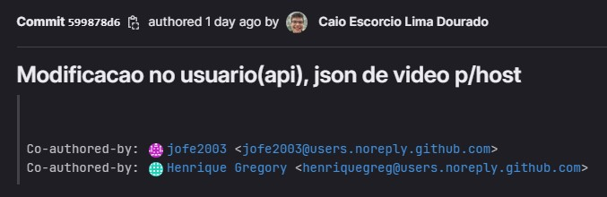

*Obs. 4: O número de commits foi contabilizado, somando todas as branchs:*

_Caio Escorcio de Lima Dourado_: 26 commits

_Celso Tadaki Sinoka_: 41 commits

_Felipe Luis Körbes_: 37 commits

_Henrique Gregory Gimenez_: 80 commits

_João Felipe de Souza Melo_: 38 commits

_Lucas Suzin Bertan_: 107 commits

*Obs. 5: a API possui um limite de pontuação. Cada requisição feita, gasta uma quantidade de pontos. Algumas requisições consomem mais pontos que outras. Caso a requisição demore demais, é um indicativo de que consome muitos pontos. Esteja atento a isso quando testar!*

## Vídeo de apresentação

Foi feito um vídeo de apresentação, mostrando como instalar o que for necessário para rodar a aplicação, bem como mostra a aplicação final funcionando. O vídeo está disponível no link abaixo:

https://drive.google.com/file/d/1ZeMyx7AabiCac4pk5VJoA0khCEhFlhpa/view?pli=1

*Errata do vídeo: a busca por tags não estava funcionando. Contudo, isso foi corrigido na versão final do projeto.*

## Conteúdo Atual do Projeto:

### package connection:
Contém as classes que realizam a conexão HTTP com a API. Neste pasta, há duas classes Authentication e HTTPRequests.

### A classe Authentication:
Obtém o token necessário para acessar a API e também o guarda como uma credencial. 

### A classe HTTPRequests:
Gerencia tudo relacionado às requisições HTTP. Essa classe monta a requisição completa, criando ou não os bodies necessários.

### package entities:
Possui as entidades básicas utilizadas no aplicativo. Isso inclui as playlists e os usuários, bem como os seus atributos e métodos que servem para interagir com a API.

### A classe Entity:
Há uma classe abstrata parametrizável chamada Entity que é extendida pelas classes
Playlist e Usuário. A classe Entity possui atributos e metódos abstratos que são compartilhados pelas demais classes. 

### A classe Playlist:
Cada instância criada pela classe playlist representa uma playlist. Essa classes possuem um array que guarda as playlists localmente e guarda as informações da playlist atual.

Além disso, possui as funções básicas que cada playlist pode fazer, por exemplo remover um vídeo da playlist, enviar uma requisição para adicionar um vídeo à conta de usuário logada, listar os dados gerais da playlist, printar a lista de vídeos da playlist, selecionar uma lista de vídeos e adicionar um vídeo. 

### A classe Usuário:
Uma instância da classe usuário representa um usuário logado no youtube. Essa classe pode listar os dados gerais de todas as playlists, criar uma playlist, printar todas as playlists criadas pelo usuário, remover uma playlist e selecionar uma determinada playlist.

### package managers:
Contém todas os gerenciadores, que basicamente compoe a camada que está de fato em contato com o nosso usuário e adequa as chamadas dos métodos das entidades mencionadas para que seja mais user-friendly.

### A classe VideoManager:
Gerencia todas as chamadas que podem ser realizadas com os vídeos. Isso inclui métodos de pesquisa de vídeo, que realiza uma request com parametros definidos pelo usuário e intermediado pelo código, e que retorna uma lista completa de informações do vídeo.

### A classe ObjectManager:
Unifica as operações que envolvem objetos como Strings e JSONs. Possui métodos para ler um arquivo e guardar seu conteúdo como um JSON, receber uma string e regularizar o seu conteúdo e receber um ArrayList 2D e chamar o método de listar os dados para obter as informações de todas as páginas com os vídeos de uma playlist em um único Array List 2D.

### package test:
Apresenta testes automatizados das principais classes e métodos utilizados.  

### package site:
Possui a classe RedPlayController que irá controlar as requisições do usuário, de modo que seja possível realizar a integração com a interface gráfica.

### A classe RedPlayDeleteController
Classe que faz a conexão entre o back-end e o front-end. Esta classe possui os métodos relacioados à requisições de deletar algo (deletar vídeo, deletar playlist, etc.). Possui a função de ser um controle entre as requisições feitas pelo front-end e o retorno dado pelo back-end. É importante notar que ainda que sejam requisições do tipo Delete, o Mapping feito pelo Springboot é do tipo Post, pois os métodos exigem um body em sua chamada.

### A classe RedPlayGetController 
Classe que faz a conexão entre o back-end e o front-end. Esta classe possui métodos relacionados a pegar informações (get), por exemplo, listar as playlists, listar vídeos, etc. Estes métodos não requerem um body em sua chamada, portanto, o Mapping feito pelo Springboot é do tipo Get. Possui a função de ser um controle entre as requisições feitas pelo front-end e o retorno dado pelo back-end.

### A classe RedPlayPostController
Classe que faz a conexão entre o back-end e o front-end. Esta classe possui métodos relacionados ao tipo Post, ou seja, adicionar vídeos, adicionar playlists, etc. Além disso, é importante notar que os métodos do tipo Post exigem um body em sua chamada. Possui a função de ser um controle entre as requisições feitas pelo front-end e o retorno dado pelo back-end.

### A classe RedPlayApplication
Classe main que inicia o SpringBoot e seus Controllers.

## Padrões de projeto utilizados
**Singleton:**  aplicado nas classes Usuário, Authentication e VideoManager para garantir que apenas uma instância dessas classes sejam criadas.

**Facade:** para requisições HTTP e Authentication (pegar access token por exemplo).

**Estratégia:** utilizando TypeScript para o front-end.

**MVC:** no back-end e no front-end.

**RESTful API:** para as requisições da API no back-end.

**Adapter:** para a HTTP request.

**Composition:** para as classes Usuario, que utiliza a classe VideoManager delegando as suas funções para esta classe.

**Manager design pattern:** delega para as classes VideoManager e ObjectManager métodos responsáveis por gerenciar os comportamentos de outras classes.

## Aplicação funcionando

Nas imagens abaixo, é possível ver como a aplicação final irá funcionar ao realizar a integração do front-end com o back-end. Para rodar a aplicação geral, é necessário iniciar 

*Há um menu para a busca dos vídeos, de acordo com os critérios.*

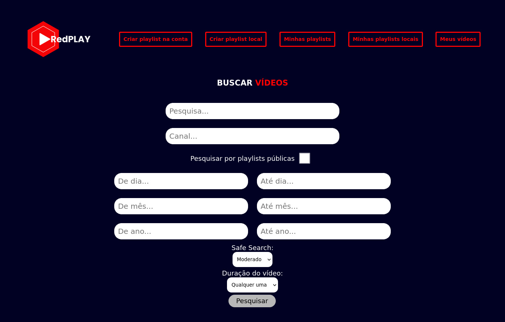

*É possível criar uma playlist tanto na conta, quanto localmente*

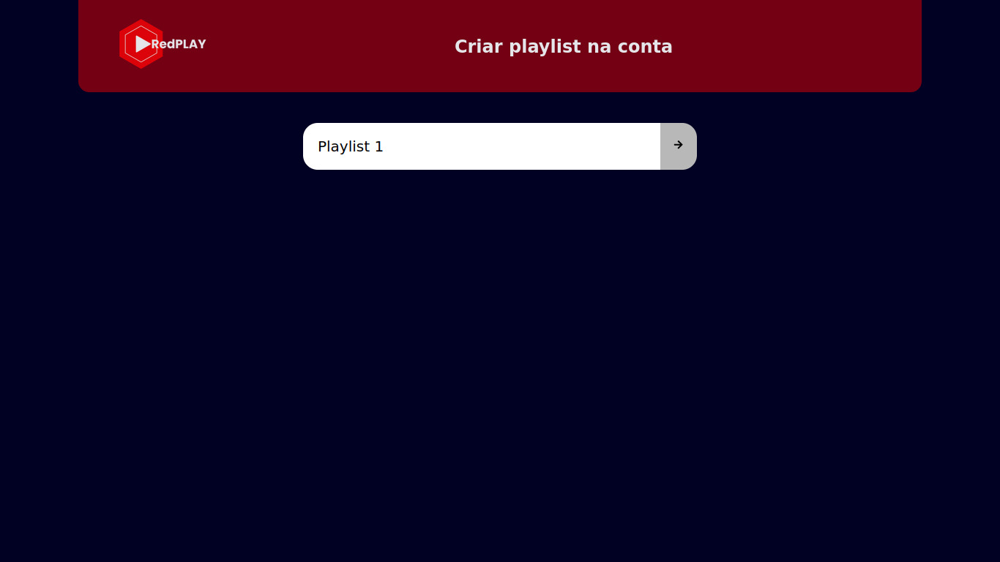

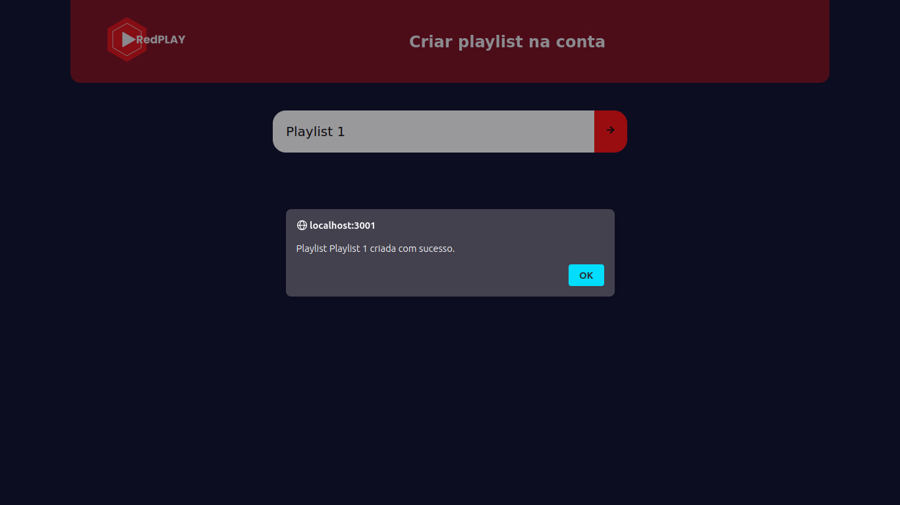

*Há uma botão para listar as playlists da conta e as playlists locais*

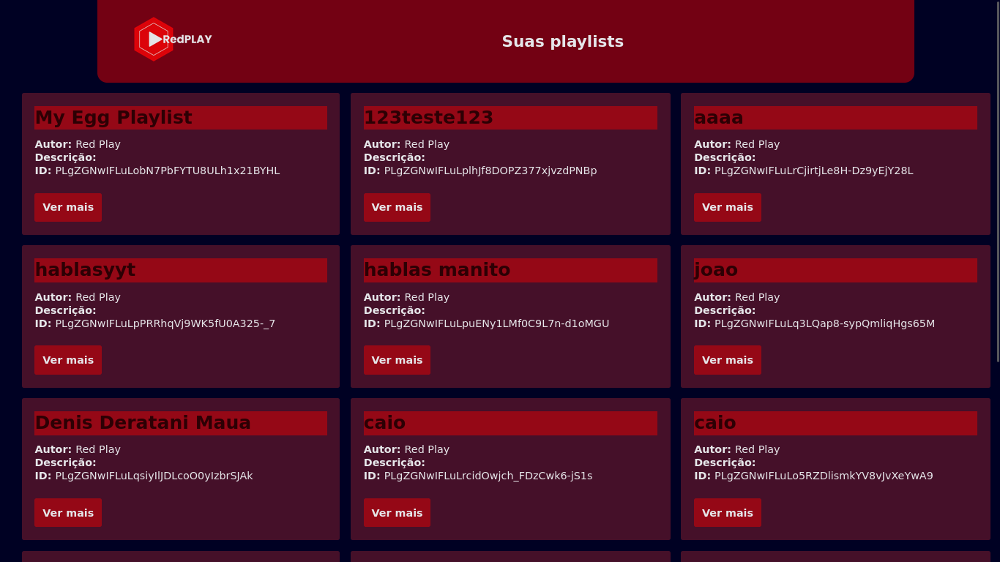

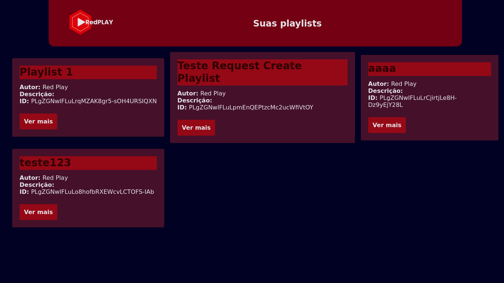

*Além disso, os vídeos contidos na playlist podem ser vistos e as informações de cada vídeo são exibidas para o usuário.*

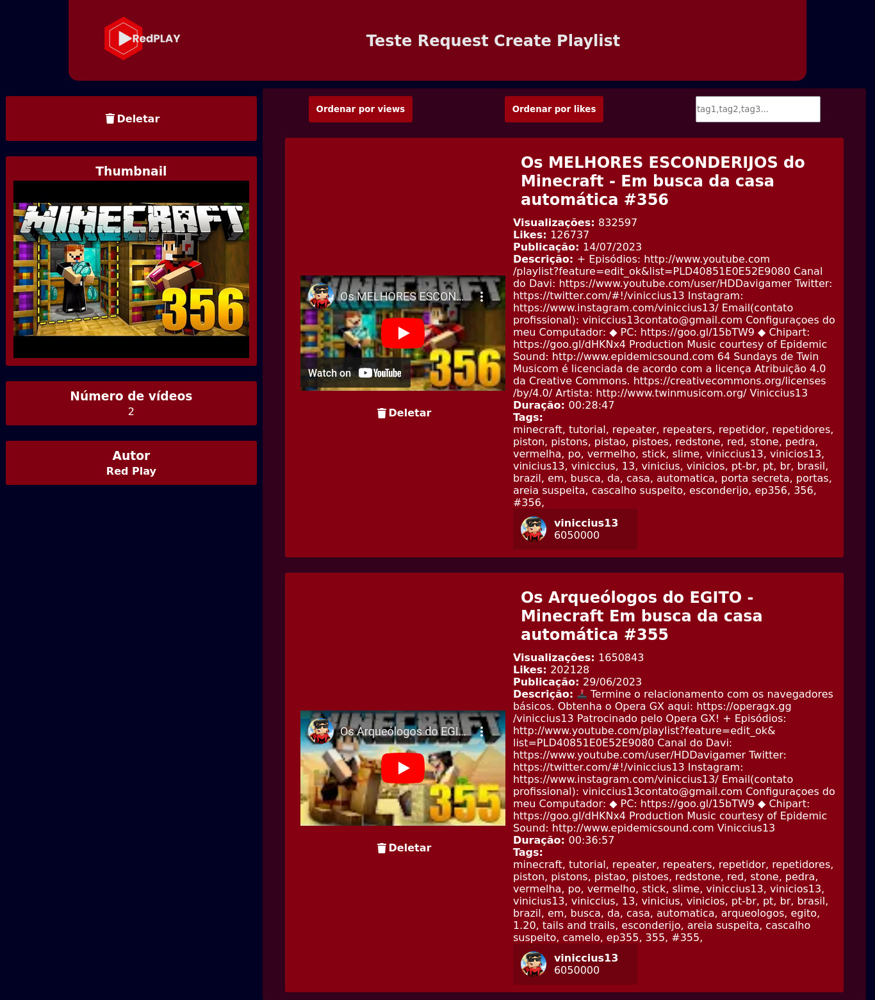

*O usuário pode adicionar um vídeo em uma playlist tanto em sua conta, quanto localmente.*

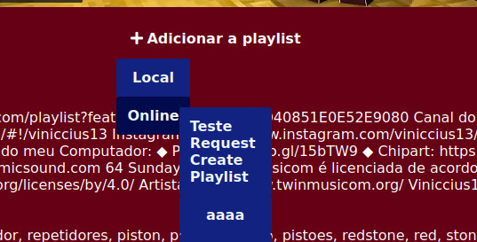

*A interface gráfica permite o usuário deletar o vídeo da playlist e deletar a playlist.*

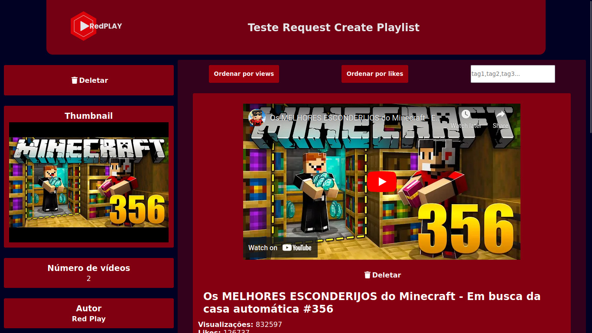

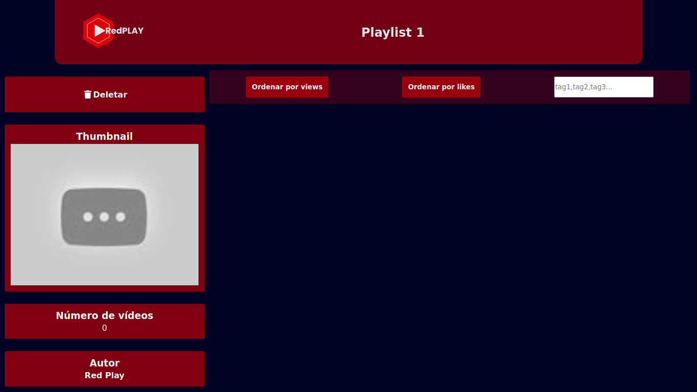

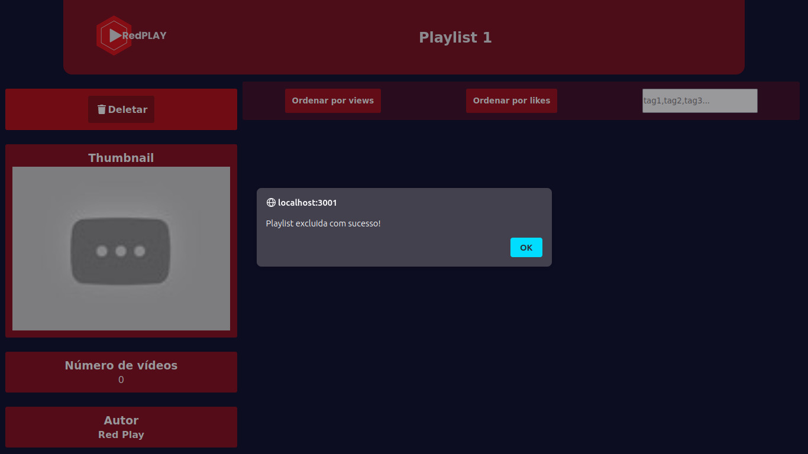

*A interface gráfica pode listar os últimos vídeos de um usuário. É possível ver a descrição, o título, a data de publicação e assistor o vídeo.*

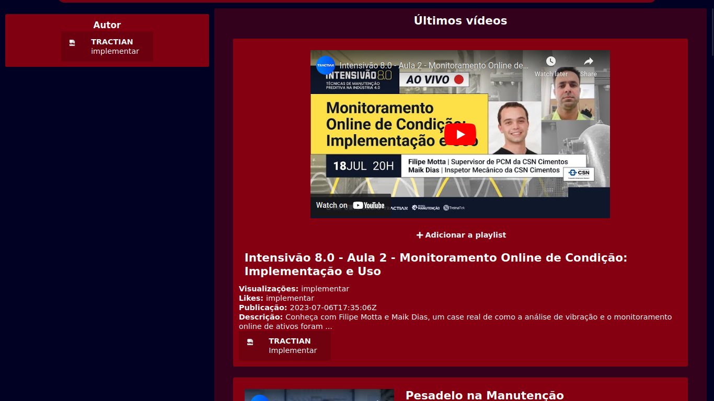

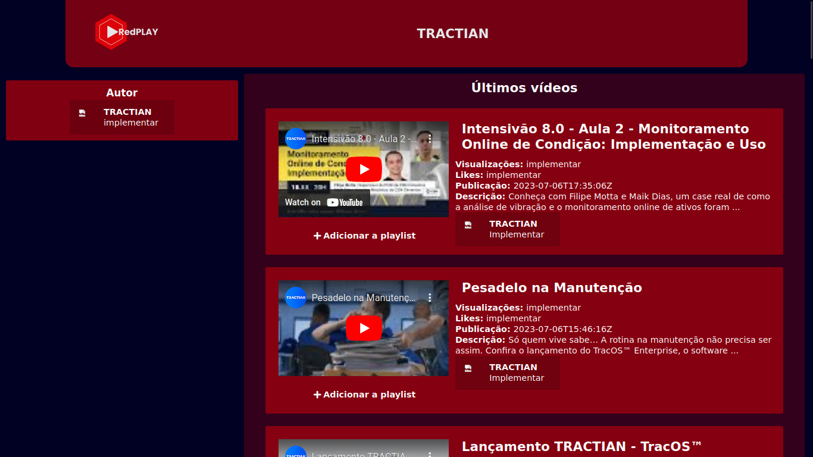

*Também é possível visualizar todos os vídeos de todas as playlists do usuário (tanto playlists locais quanto na conta). A partir disso, o usuário pode fazer uma busca por estes vídeos a partir de suas tags.*

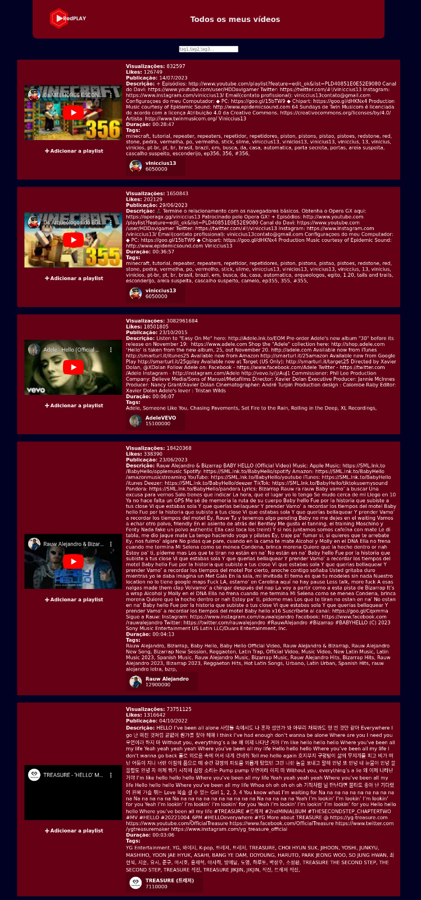

# Entrega 2

Na entrega 2, o requisito 1 foi completado. Existem quatros pastas principais que dividem as diversas funções do projeto RedPlay. As pastas são:
connection, entities, managers e test. 

Além disso, para a execução geral do projeto há uma classe que implementa uma interface geral no terminal chamada SyncfitApplication. O caminho até a classe é mac0321-projeto-i-gerenciador-de-playlists-do-youtube/src/main/java/com/syncfit/syncfit

Obs.: para realizar os testes da aplicação foi utilizada uma conta pessoal de um dos membros. Posteriormente, isso será alterado para uma conta específica do projeto.

## Requisitos

[X] O usuário pode criar uma ou mais playlists com vídeos

[X] Playlists podem ser criadas dentro da conta de um usuário do youtube

[X] Playslists podem ser criadas localmente pelo sistema

[X] Playlists nomeadas pelo usuário

[X] Busca por vídeo

[X] Seleção de vídeos (1 ou mais)

[X] Inserção destas na playlist escolhida

# Entrega 3

A partir da entrega 3, será necessário uma interface gráfica para a aplicação. Assim sendo, o projeto foi dividido em dois grandes grupos: front-end e back-end. Também é válido apontar que para o conteúdo da entrega 3 cobre mais requisitos que aqueles pedidos por esta entrega. Os requisitos de exibir a thumbnail dos vídeos, quantidade de likes, título, autor, é possível visualizar o vídeo, etc. Além disso, o método para a busca baseado em parâmetros também já está implementado nesta entrega. Os requisitos de cada um estão listados abaixo:

### Requisitos Back-end

[X] Requisição para busca por vídeos de acordo com título do vídeo

[X] Requisição para busca por nome de uma playlist

[X] Requisição para busca por nome de autor do vídeo

[X] Requisição para busca de informações do vídeo (like, dislike, descrição, etc.)

[X] Criar uma classe que realiza a comunicação entre as requisições e a interface gráfica

Para o back-end foi aplicado o padrão de projeto Singleton nas classes Authentication, Usuario e VideoManager, de modo a garantir que apenas uma única instâncias dessas classes sejam criadas. 

### Requisitos Front-end

[X] Página de entrada da aplicação.

[X] Página para criação de playlists locais.

[X] Página para criação de playlists na conta do usuário.

[X] Ordenação dos vídeos por views e por likes.

[X] Ordenação por tags.

[X] Arrumar barra de pesquisa para ter mais parâmetros.

[X] Página que lista os dados de um usuário e os últimos vídeos.

[X] Página que lista todas as playlists, permitindo que o usuário navegue e visualize detalhes de cada uma delas.

[X] Página que lista detalhes de uma playlist em específico, permitindo que o usuário visualize os vídeos dela e possa deletá-los.

[X] Componente que visualiza informações adicionais de um vídeo.

[X] Conexão com o backend e renderizar tudo de acordo com o que ele enviar.

# Entrega 4

### Requisitos Back-end

[X] Retornar a thumnail dos vídeos.

[X] Retornar estatísticas dos vídeos ao listar os vídeos de uma playlist.

[X] Retornar o link do vídeo para que o usuário possa assistir.

[X] Filtrar a busca de um vídeo baseado nos parâmetros de duração do vídeo, tempo de postagem e restrição de idade.

[X] Listar todos os vídeos de todas as playlists.

### Requisitos Front-end

[X] Página que lista vídeos e playlists pesquisados.

[X] Listar todos os vídeos de todas as playlists. O usuário pode fazer uma busca nesses vídeos, de acordo com um determinado parâmetro baseado numa string de busca. É válido notar que o parâmetro escolhido para essa busca foram as tags dos vídeos.

# Instruções para testar

### Instruções para o Back-end
Para o back-end, é possível rodar cada classe separadamente. Contudo, recomenda-se que para visualizar as operações feitas utlizar a classe RedplayApplication.java que realizará a comunicação entre o back-end e front-end por meio do controlador.

Para visualizar as requisições, recomenda-se utilizar o programa Insomnia. No Windows, o download pode ser feito pelo seguinte links: https://insomnia.rest/download. No Ubuntu e Debian, o download pode ser feito pelo seguinte comando no terminal: sudo apt-get install insomnia.

Ao instalar, crie um novo projeto no Insomina conforme a imagem abaixo:

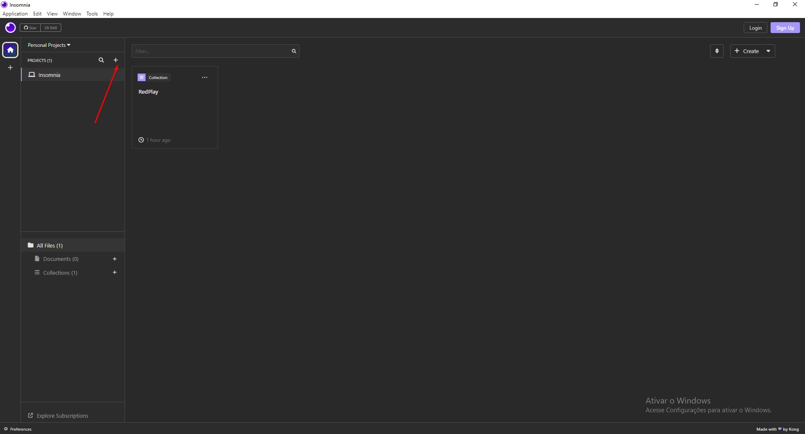

Em seguida clique em *Create* para criar um novo projeto:

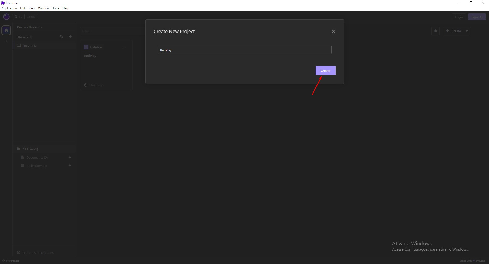

Para testar uma requisição, crie uma nova requisição HTTP assim como na imagem:

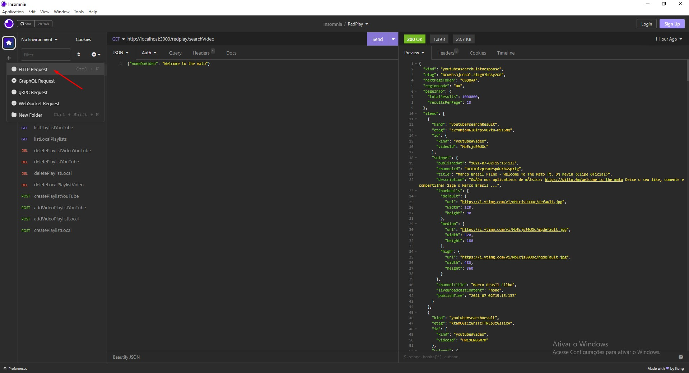

Cada operação possui três tipos diferentes de requisição: GET, DELETE E POST. As requisições de cada tipo estão separadas no RedPlayController por meio de um comentário. É possível mudar o tipo da requisição HTTP a ser testada conforme a imagem:

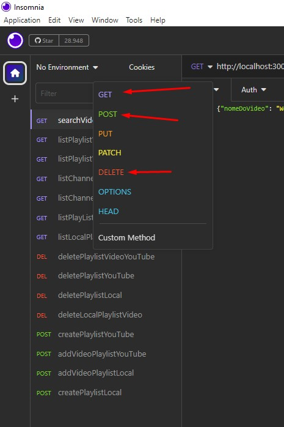

Algumas requisições exigem que parâmetros sejam passados. Assim sendo é necessário criar um body JSON.

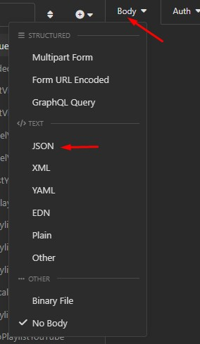

Dependendo da requisição a ser testada é necessário criar o JSON. Verifique para cada requisição qual serão os parâmetros a serem passados. O JSON é criado da seguinte maneira:

*{"Parâmetro1": "ValorDoParâmetro1"}*

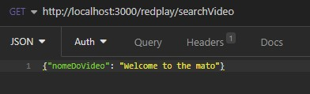

Em seguida, é necessário criar a rota para a requisição. Todas as requisições iniciam da seguinte maneira:

*http://localhost:3000/redplay*

Cada requisição possui uma rota específica que está escrita no início de cada método do RedPlayController, como no seguinte exemplo:

*@GetMapping(path = "/searchVideo", produces="application/json", consumes="application/json")*

A rota para a requisição será /searchVideo. Portanto, a rota final para está dada requisição será: 

*http://localhost:3000/redplay/searchVideo*

No tópico seguinte, há uma lista com as rotas de todos os métodos utilizados.
Esta rota deverá ser adicionada no Insomnia conforme a imagem:

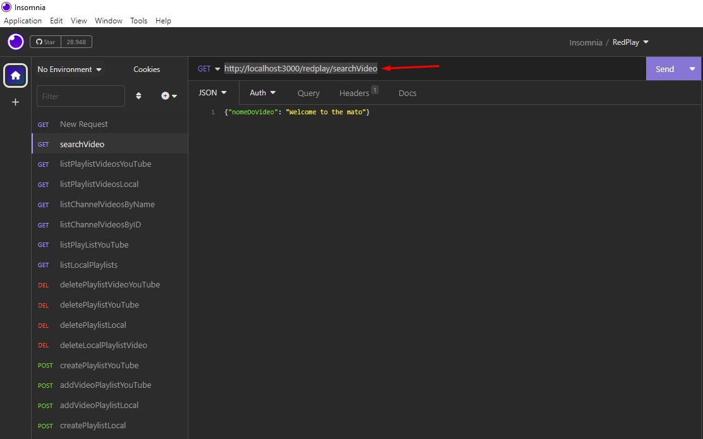

Por fim, é possível testar a requisição clicando no botão *Send* e na janela à direita é possível ver o JSON retornado pela requisição!

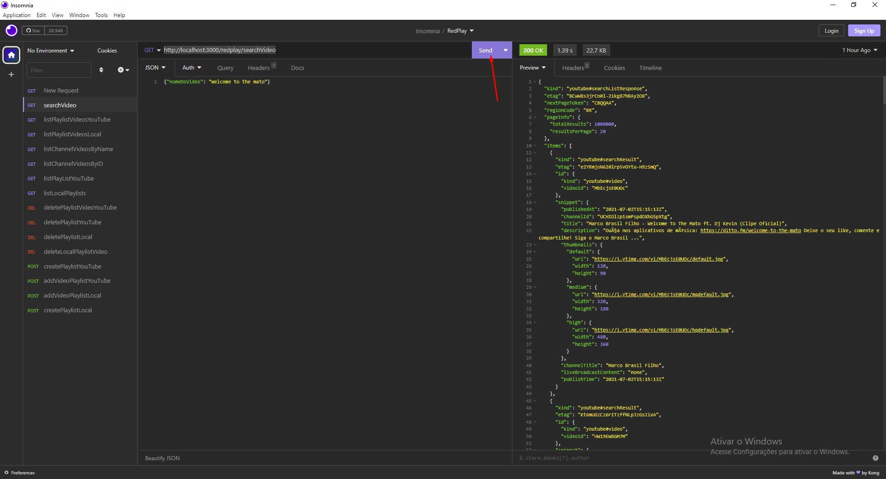

Além disso, há testes para o back-end feitos com o JUnit que estão incluídos no diretório test.

### Instruções para o front-end

Antes de tudo, instale o NodeJs.

Se estiver no Windows, baixe e instale usando o link: https://nodejs.org/en

Se estiver no Linux (Ubuntu/Debian), use:
``sudo apt update``
``sudo apt install nodejs``

Agora, instale os pacotes necessários e especificados no arquivo package.json com o comando (rodando na raiz deste código):

``npm install``

Depois, rode o ambiente de desenvolvimento com:

``npm start``

Assim que ele terminar de configurar, o navegador vai abrir em um localhost.

Para os testes do frontend, estudamos a biblioteca JEST, e fizemos alguns testes experimentais, mas acabamos não evoluindo muito porque os testes de renderização do frontend não estavam fazendo muito sentido para o desenvolvimento da aplicação.

## Lista de rotas

| Método | Tipo | Rota |
|--------|------|------| 
| searchVideo | Post | http://localhost:3000/redplay/searchVideo |
| searchPlaylist | Post |http://localhost:3000/redplay/searchPlaylist |
| getInfoVideo | Post | http://localhost:3000/redplay/infovideo |
| listChannelVideosByName | Post | http://localhost:3000/redplay/listChannelVideosByName |
| listChannelVideosByID | Post | http://localhost:3000/redplay/listChannelVideosByID |
| listPlaylistVideosLocal | Post | http://localhost:3000/redplay/listPlaylistVideosLocal |
| listPlaylistVideosYouTube | Post | http://localhost:3000/redplay/listPlaylistVideosYouTube |
| createPlaylistLocal | Post | http://localhost:3000/redplay/createPlaylistLocal | 
| createPlaylistYouTube | Post | http://localhost:3000/redplay/createPlaylistYouTube |
| addVideoPlayListLocal | Post | http://localhost:3000/redplay/addVideoPlaylistLocal |
| addVideoYoutube | Post | http://localhost:3000/redplay/addVideoPlaylistYouTube |
| deleteLocalPlaylist | Post | http://localhost:3000/redplay/deletePlaylistLocal |
| deletePlaylist | Post | http://localhost:3000/redplay/deletePlaylistYouTube |
| deleteLocalPlaylistVideo | Post | http://localhost:3000/redplay/deleteLocalPlaylistVideo | 
| deletePlaylistVideoYouTube | Post | http://localhost:3000/redplay/deletePlaylistVideoYouTube | 
| listPlayListLocal | Get | http://localhost:3000/redplay/listPlayListLocal |
| listPlayListYouTube | Get | http://localhost:3000/redplay/listPlayListYouTube |
| listAllVideosAllPlaylists | Get | http://localhost:3000/redplay/listAllVideosAllPlaylists |
